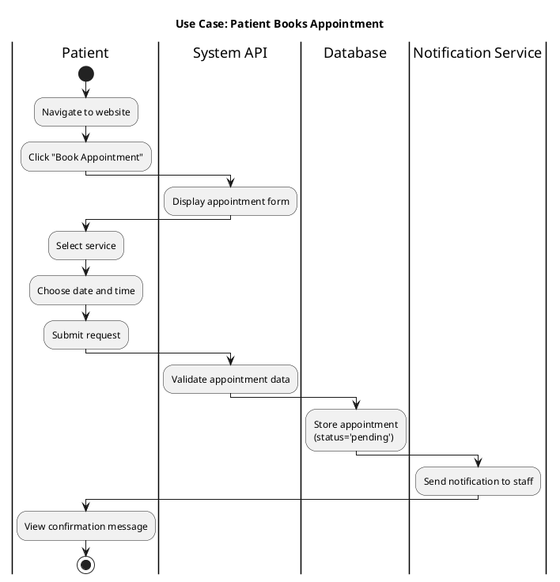

# AI Swimlanes Generator Prompt for Dorotheo Dental Clinic Management System

## Instructions for AI Generator
Generate comprehensive Activity Diagrams with Swimlanes for the Dorotheo Dental Clinic Management System. Each diagram should clearly show the workflow across different actors and system components.

---

## Project Context

**System Name:** Dorotheo Dental Clinic Management System  
**Purpose:** A web-based dental clinic management system with patient portal, staff management, and appointment scheduling  

**Technology Stack:**

### Frontend
- **Framework:** Next.js 15.2.4 (React 19)
- **Language:** TypeScript 5
- **Styling:** Tailwind CSS 4.1.9 with Tailwind Animate
- **UI Components:** Shadcn/UI built on Radix UI primitives
  - Radix UI components (dialogs, dropdowns, forms, etc.)
  - Custom components with class-variance-authority
- **State Management:** React Hook Form 7.60.0 with Zod 3.25 validation
- **Icons:** Lucide React 0.454.0
- **Date Handling:** date-fns 4.1.0, react-day-picker 9.8.0
- **Charts/Graphs:** Recharts 2.15.4
- **Notifications:** Sonner 1.7.4 (toast notifications)
- **Theme:** next-themes 0.4.6 (dark/light mode)
- **Analytics:** Vercel Analytics 1.3.1
- **Package Manager:** pnpm

### Backend
- **Framework:** Django 4.2.7
- **API:** Django REST Framework 3.14.0
- **Authentication:** Token-based (Django REST Framework Auth Token)
- **CORS:** django-cors-headers 4.3.1
- **Image Processing:** Pillow 10.3.0+
- **Language:** Python 3.x

### Database
- **Development:** SQLite (db.sqlite3)
- **Production-Ready:** Can migrate to PostgreSQL/MySQL

### Architecture
- **Type:** RESTful API with token-based authentication
- **Frontend-Backend Communication:** HTTP/HTTPS requests via fetch API
- **File Uploads:** Media files stored in backend `/media/` directory
- **Deployment:** 
  - Frontend: Can deploy to Vercel, Netlify, or any Node.js hosting
  - Backend: Can deploy to Heroku, Railway, DigitalOcean, or any Python hosting

### Key Features Built With:
- **Forms & Validation:** React Hook Form + Zod schemas
- **Data Tables:** Custom tables with Radix UI components
- **Modals/Dialogs:** Radix UI Dialog/AlertDialog
- **Responsive Design:** Tailwind CSS mobile-first approach
- **Real-time Updates:** Client-side polling (no WebSockets currently)
- **File Upload:** Native HTML file input with Pillow backend processing

---

## System Actors (Swimlanes)

Please create separate swimlanes for each of the following actors:

1. **Patient** - End users who book appointments and access their records
2. **Receptionist** - Staff members who manage appointments and patient check-ins
3. **Dentist** - Healthcare providers who conduct treatments and update records
4. **Owner/Admin** - Clinic owner with full system access and analytics
5. **System (Backend API)** - Django REST API processing business logic
6. **Database** - Data persistence layer (SQLite/PostgreSQL)
7. **Notification Service** - (If applicable) Email/SMS notifications

---

## Core Business Processes to Generate Swimlanes For

---

## PROCESS 1: PATIENT REGISTRATION AND LOGIN

### Process Overview
New patients register on the website to create an account and gain access to the patient portal.

### Actors Involved
- Patient
- System (Backend API)
- Database

### Process Steps

#### **Phase 1: Registration**
1. **[PATIENT]** Opens website homepage
2. **[PATIENT]** Clicks "Register" button on navbar
3. **[SYSTEM]** Displays registration modal/form
4. **[PATIENT]** Fills in registration form:
   - First Name
   - Last Name
   - Email Address
   - Phone Number
   - Password
   - Confirm Password
   - Birthday
   - Address
5. **[PATIENT]** Clicks "Submit" button
6. **[SYSTEM]** Validates form data:
   - Check all required fields filled
   - Check email format valid
   - Check passwords match
   - Check password strength
7. **[SYSTEM]** Sends POST request to `/api/register/`
8. **[SYSTEM]** Checks email uniqueness in database
9. **[DATABASE]** Query existing users with same email

**Decision Point:** Is email already registered?
- **YES → Error Path:**
  - **[SYSTEM]** Returns error: "Email already exists"
  - **[PATIENT]** Sees error message
  - Process returns to step 4
- **NO → Success Path:**
  - **[DATABASE]** Creates new User record with:
    - `user_type = 'patient'`
    - `username = email`
    - `email = provided email`
    - `password = hashed password`
    - Other profile fields
  - **[SYSTEM]** Returns success response with user data
  - **[PATIENT]** Sees success message: "Registration successful!"
  - **[SYSTEM]** Automatically logs in patient
  - **[SYSTEM]** Redirects to patient dashboard

#### **Phase 2: Login (Returning Users)**
1. **[PATIENT]** Clicks "Login" button on navbar
2. **[SYSTEM]** Displays login page
3. **[PATIENT]** Enters credentials:
   - Email or Username
   - Password
4. **[PATIENT]** Clicks "Login"
5. **[SYSTEM]** Sends POST request to `/api/login/`
6. **[SYSTEM]** Validates credentials against database
7. **[DATABASE]** Queries User table

**Decision Point:** Are credentials valid?
- **NO → Error Path:**
  - **[SYSTEM]** Returns error: "Invalid credentials"
  - **[PATIENT]** Sees error message
  - Process returns to step 3
- **YES → Success Path:**
  - **[SYSTEM]** Generates JWT access token and refresh token
  - **[SYSTEM]** Returns tokens and user data
  - **[SYSTEM]** Stores tokens in browser localStorage
  - **[SYSTEM]** Redirects based on user_type:
    - patient → `/patient/dashboard`
    - staff → `/staff/dashboard`
    - owner → `/owner/dashboard`
  - **[PATIENT]** Successfully logged in

### End State
Patient has active session and can access portal features.

---

## PROCESS 2: BOOK APPOINTMENT (PATIENT PORTAL)

### Process Overview
Logged-in patients request appointments through the patient portal.

### Actors Involved
- Patient
- System (Backend API)
- Database
- Notification Service (optional)

### Process Steps

#### **Phase 1: Navigate to Appointments**
1. **[PATIENT]** Already logged into patient portal
2. **[PATIENT]** Clicks "Appointments" in sidebar navigation
3. **[SYSTEM]** Loads appointments page
4. **[SYSTEM]** Sends GET request to `/api/appointments/`
5. **[DATABASE]** Queries appointments for current patient
6. **[SYSTEM]** Displays patient's existing appointments
7. **[PATIENT]** Clicks "Book New Appointment" button

#### **Phase 2: Select Service**
8. **[SYSTEM]** Opens appointment booking modal/form
9. **[SYSTEM]** Sends GET request to `/api/services/`
10. **[DATABASE]** Retrieves all available services
11. **[SYSTEM]** Displays services grouped by category:
    - Orthodontics
    - Restorations
    - X-Rays
    - Oral Surgery
    - Preventive
12. **[PATIENT]** Selects desired service from dropdown

#### **Phase 3: Choose Date and Time**
13. **[PATIENT]** Selects preferred date (date picker)
14. **[PATIENT]** Selects preferred time (time picker)
15. **[PATIENT]** Optionally selects preferred dentist from dropdown
16. **[PATIENT]** Adds appointment notes (optional text area)

#### **Phase 4: Submit Request**
17. **[PATIENT]** Clicks "Submit Appointment Request"
18. **[SYSTEM]** Validates form data:
    - Service selected
    - Date is in future
    - Time is provided
19. **[SYSTEM]** Sends POST request to `/api/appointments/`

**Decision Point:** Is validation successful?
- **NO → Error Path:**
  - **[SYSTEM]** Shows validation errors
  - **[PATIENT]** Corrects errors
  - Process returns to step 17
- **YES → Continue:**

#### **Phase 5: Create Appointment**
20. **[DATABASE]** Creates new Appointment record:
    - `patient = current_user.id`
    - `service = selected_service.id`
    - `dentist = selected_dentist.id` (or NULL)
    - `date = selected_date`
    - `time = selected_time`
    - `notes = patient_notes`
    - `status = 'pending'`
    - `created_at = current_timestamp`
21. **[DATABASE]** Saves appointment record
22. **[SYSTEM]** Returns success response with appointment ID

#### **Phase 6: Confirmation**
23. **[SYSTEM]** Displays success message: "Appointment request submitted!"
24. **[SYSTEM]** Shows appointment details
25. **[SYSTEM]** Updates appointments list to include new appointment
26. **[NOTIFICATION SERVICE]** (Optional) Sends notification to receptionist staff
27. **[PATIENT]** Can view appointment in "My Appointments" list with status "Pending"

### End State
Appointment created with status='pending', waiting for staff confirmation.

---

## PROCESS 3: APPOINTMENT CONFIRMATION (RECEPTIONIST)

### Process Overview
Receptionist reviews pending appointments and approves or rejects them.

### Actors Involved
- Receptionist
- System (Backend API)
- Database
- Notification Service (optional)
- Patient (receives notification)

### Process Steps

#### **Phase 1: View Pending Appointments**
1. **[RECEPTIONIST]** Logs into staff portal
2. **[RECEPTIONIST]** Navigates to dashboard
3. **[SYSTEM]** Displays dashboard with appointment summary
4. **[SYSTEM]** Highlights pending appointments count
5. **[RECEPTIONIST]** Clicks "Appointments" in navigation
6. **[SYSTEM]** Sends GET request to `/api/appointments/`
7. **[DATABASE]** Queries all appointments (receptionist has full access)
8. **[SYSTEM]** Displays appointments with filters
9. **[RECEPTIONIST]** Filters by `status = 'pending'`

#### **Phase 2: Review Appointment Details**
10. **[RECEPTIONIST]** Clicks on a pending appointment
11. **[SYSTEM]** Displays appointment details:
    - Patient name and contact
    - Requested service
    - Requested date and time
    - Preferred dentist
    - Patient notes
12. **[RECEPTIONIST]** Reviews clinic schedule
13. **[RECEPTIONIST]** Checks for scheduling conflicts
14. **[RECEPTIONIST]** Verifies dentist availability

**Decision Point:** Should appointment be approved?

#### **Path A: APPROVE APPOINTMENT**
15a. **[RECEPTIONIST]** Clicks "Confirm Appointment" button
16a. **[SYSTEM]** Sends PATCH request to `/api/appointments/{id}/`
17a. **[SYSTEM]** Updates appointment:
    - `status = 'confirmed'`
    - `updated_at = current_timestamp`
18a. **[DATABASE]** Saves updated appointment
19a. **[SYSTEM]** Returns success response
20a. **[SYSTEM]** Displays success message: "Appointment confirmed"
21a. **[SYSTEM]** Updates appointment card to show "Confirmed" badge
22a. **[NOTIFICATION SERVICE]** (Optional) Sends confirmation to patient:
    - Email with appointment details
    - SMS reminder (if configured)
23a. **[PATIENT]** Sees appointment status changed to "Confirmed" in portal

#### **Path B: REJECT APPOINTMENT**
15b. **[RECEPTIONIST]** Clicks "Cancel Appointment" button
16b. **[SYSTEM]** Prompts for cancellation reason (modal/dialog)
17b. **[RECEPTIONIST]** Enters reason (e.g., "Requested time slot not available")
18b. **[RECEPTIONIST]** Clicks "Confirm Cancellation"
19b. **[SYSTEM]** Sends PATCH request to `/api/appointments/{id}/`
20b. **[SYSTEM]** Updates appointment:
    - `status = 'cancelled'`
    - `cancel_reason = entered_reason`
    - `updated_at = current_timestamp`
21b. **[DATABASE]** Saves updated appointment
22b. **[SYSTEM]** Returns success response
23b. **[SYSTEM]** Displays success message: "Appointment cancelled"
24b. **[NOTIFICATION SERVICE]** (Optional) Notifies patient of cancellation with reason
25b. **[PATIENT]** Sees appointment status changed to "Cancelled" with reason

### End State
Appointment either confirmed or cancelled with appropriate notifications sent.

---

## PROCESS 4: RESCHEDULE APPOINTMENT WORKFLOW

### Process Overview
Patient requests to reschedule an existing appointment, which requires receptionist approval.

### Actors Involved
- Patient
- Receptionist
- System (Backend API)
- Database
- Notification Service (optional)

### Process Steps

#### **Phase 1: Patient Initiates Reschedule**
1. **[PATIENT]** Logs into patient portal
2. **[PATIENT]** Navigates to "My Appointments"
3. **[SYSTEM]** Displays patient's appointments
4. **[PATIENT]** Finds appointment to reschedule
5. **[PATIENT]** Clicks "Reschedule" button

**Validation:** Can appointment be rescheduled?
- **[SYSTEM]** Checks appointment status
- Only allows reschedule if `status = 'pending'` or `'confirmed'`
- If `status = 'completed'` or `'cancelled'`, show error

#### **Phase 2: Enter New Schedule**
6. **[SYSTEM]** Opens reschedule modal/form
7. **[SYSTEM]** Pre-fills current appointment details
8. **[PATIENT]** Modifies desired fields:
   - New date
   - New time
   - Different service (optional)
   - Different dentist (optional)
9. **[PATIENT]** Adds reschedule reason/notes
10. **[PATIENT]** Clicks "Submit Reschedule Request"

#### **Phase 3: System Processes Request**
11. **[SYSTEM]** Validates new schedule data
12. **[SYSTEM]** Sends PATCH request to `/api/appointments/{id}/`
13. **[DATABASE]** Updates appointment record with reschedule fields:
    - `reschedule_date = new_date`
    - `reschedule_time = new_time`
    - `reschedule_service = new_service_id` (if changed)
    - `reschedule_dentist = new_dentist_id` (if changed)
    - `reschedule_notes = patient_notes`
    - `status = 'reschedule_requested'`
    - Original fields remain unchanged (date, time, service, dentist)
14. **[DATABASE]** Saves updated appointment
15. **[SYSTEM]** Returns success response
16. **[SYSTEM]** Displays message: "Reschedule request submitted!"
17. **[PATIENT]** Sees appointment status changed to "Reschedule Requested"
18. **[NOTIFICATION SERVICE]** (Optional) Notifies receptionist of reschedule request

#### **Phase 4: Receptionist Reviews Request**
19. **[RECEPTIONIST]** Logs into staff portal
20. **[RECEPTIONIST]** Navigates to Appointments
21. **[SYSTEM]** Displays appointments with "Reschedule Requested" filter
22. **[RECEPTIONIST]** Clicks on appointment with reschedule request
23. **[SYSTEM]** Displays comparison:
    - **Current Schedule:** [original date/time/service/dentist]
    - **Requested Schedule:** [new date/time/service/dentist]
    - **Patient Reason:** [reschedule_notes]
24. **[RECEPTIONIST]** Reviews new schedule
25. **[RECEPTIONIST]** Checks for conflicts

**Decision Point:** Approve or reject reschedule?

#### **Path A: APPROVE RESCHEDULE**
26a. **[RECEPTIONIST]** Clicks "Approve Reschedule" button
27a. **[SYSTEM]** Sends POST request to `/api/appointments/{id}/approve_reschedule/`
28a. **[SYSTEM]** Backend logic executes:
    - Copy reschedule fields to main fields:
      - `date = reschedule_date`
      - `time = reschedule_time`
      - `service = reschedule_service`
      - `dentist = reschedule_dentist`
    - Clear reschedule fields:
      - `reschedule_date = NULL`
      - `reschedule_time = NULL`
      - `reschedule_service = NULL`
      - `reschedule_dentist = NULL`
      - `reschedule_notes = NULL`
    - Update status:
      - `status = 'confirmed'`
29a. **[DATABASE]** Saves updated appointment
30a. **[SYSTEM]** Returns success response
31a. **[SYSTEM]** Displays message: "Reschedule approved"
32a. **[NOTIFICATION SERVICE]** (Optional) Notifies patient:
    - "Your reschedule request has been approved"
    - Shows new appointment details
33a. **[PATIENT]** Sees updated appointment with new date/time in portal

#### **Path B: REJECT RESCHEDULE**
26b. **[RECEPTIONIST]** Clicks "Reject Reschedule" button
27b. **[SYSTEM]** Prompts for rejection reason
28b. **[RECEPTIONIST]** Enters reason (e.g., "Requested time slot unavailable")
29b. **[RECEPTIONIST]** Clicks "Confirm Rejection"
30b. **[SYSTEM]** Sends POST request to `/api/appointments/{id}/reject_reschedule/`
31b. **[SYSTEM]** Backend logic executes:
    - Clear all reschedule fields
    - Revert status to previous state ('confirmed' or 'pending')
32b. **[DATABASE]** Saves updated appointment
33b. **[SYSTEM]** Returns success response
34b. **[SYSTEM]** Displays message: "Reschedule rejected"
35b. **[NOTIFICATION SERVICE]** (Optional) Notifies patient with rejection reason
36b. **[PATIENT]** Sees appointment reverted to original schedule
37b. **[PATIENT]** Sees rejection reason
38b. **[PATIENT]** Can submit new reschedule request if needed

### End State
Appointment either rescheduled to new date/time or kept at original schedule.

---

## PROCESS 5: CANCEL APPOINTMENT WORKFLOW

### Process Overview
Patient requests to cancel an appointment with a reason.

### Actors Involved
- Patient
- Receptionist (optional reviewer)
- System (Backend API)
- Database

### Process Steps

#### **Phase 1: Patient Initiates Cancellation**
1. **[PATIENT]** Logs into patient portal
2. **[PATIENT]** Navigates to "My Appointments"
3. **[SYSTEM]** Displays patient's appointments
4. **[PATIENT]** Locates appointment to cancel
5. **[PATIENT]** Clicks "Cancel Appointment" button

**Validation:** Can appointment be cancelled?
- **[SYSTEM]** Checks appointment status
- Only allows cancel if `status != 'cancelled'` and `status != 'completed'`

#### **Phase 2: Provide Cancellation Reason**
6. **[SYSTEM]** Opens cancellation confirmation modal
7. **[SYSTEM]** Displays appointment details as reminder
8. **[SYSTEM]** Prompts for cancellation reason
9. **[PATIENT]** Enters reason (required text field):
   - Examples: "Personal emergency", "Schedule conflict", "Feeling unwell"
10. **[PATIENT]** Clicks "Confirm Cancellation"

#### **Phase 3: System Processes Cancellation**
11. **[SYSTEM]** Validates cancellation reason provided
12. **[SYSTEM]** Sends PATCH request to `/api/appointments/{id}/`
13. **[DATABASE]** Updates appointment record:
    - `cancel_reason = patient_reason`
    - `status = 'cancel_requested'`
    - `updated_at = current_timestamp`
14. **[DATABASE]** Saves updated appointment
15. **[SYSTEM]** Returns success response
16. **[SYSTEM]** Displays message: "Cancellation request submitted"
17. **[PATIENT]** Sees appointment status changed to "Cancel Requested"
18. **[NOTIFICATION SERVICE]** (Optional) Notifies receptionist

#### **Phase 4: Receptionist Reviews (Optional)**
19. **[RECEPTIONIST]** Logs into staff portal
20. **[RECEPTIONIST]** Sees appointments with "Cancel Requested" status
21. **[RECEPTIONIST]** Reviews cancellation reason
22. **[RECEPTIONIST]** Clicks "Confirm Cancellation" button
23. **[SYSTEM]** Sends PATCH request to `/api/appointments/{id}/`
24. **[DATABASE]** Updates appointment:
    - `status = 'cancelled'`
    - `cancel_reason` remains stored
25. **[DATABASE]** Saves updated appointment
26. **[SYSTEM]** Returns success response
27. **[NOTIFICATION SERVICE]** (Optional) Confirms cancellation to patient
28. **[PATIENT]** Sees appointment status changed to "Cancelled"

### End State
Appointment cancelled with reason recorded in database.

---

## PROCESS 6: ADD DENTAL RECORDS (DENTIST)

### Process Overview
Dentist documents treatment and diagnosis after patient consultation/procedure.

### Actors Involved
- Dentist
- System (Backend API)
- Database
- Patient (can view later)

### Process Steps

#### **Phase 1: Access Patient Profile**
1. **[DENTIST]** Logs into staff portal
2. **[DENTIST]** Navigates to "Patients" page
3. **[SYSTEM]** Sends GET request to `/api/users/?user_type=patient`
4. **[DATABASE]** Queries all patient records
5. **[SYSTEM]** Displays patient list with search/filter
6. **[DENTIST]** Searches for patient by name/email/phone
7. **[DENTIST]** Clicks on patient row to expand details

#### **Phase 2: View Patient History**
8. **[SYSTEM]** Expands patient card showing:
   - Personal information
   - Existing dental records
   - Tooth chart
   - Uploaded documents
   - Teeth images
   - Appointment history
9. **[DENTIST]** Reviews previous records (if any)

#### **Phase 3: Create New Dental Record**
10. **[DENTIST]** Clicks "Add Dental Record" button
11. **[SYSTEM]** Opens dental record form modal
12. **[DENTIST]** Fills in record details:
    - **Treatment Performed** (text area): "Root canal on tooth #14"
    - **Diagnosis** (text area): "Deep cavity with pulp exposure"
    - **Tooth Number** (input): "14"
    - **Notes** (text area): Additional observations
    - **Date** (auto-filled with today's date)
13. **[DENTIST]** Optionally uploads supporting documents:
    - X-ray images
    - Scan files
    - Reports (PDF)

#### **Phase 4: Upload Teeth Images (Optional)**
14. **[DENTIST]** Clicks "Upload Teeth Image" section
15. **[DENTIST]** Selects image file (before/after photos)
16. **[DENTIST]** Adds image description
17. **[DENTIST]** Marks as "Latest" (checkbox)
18. **[SYSTEM]** Validates file type and size

#### **Phase 5: Submit Record**
19. **[DENTIST]** Reviews all entered information
20. **[DENTIST]** Clicks "Save Dental Record"
21. **[SYSTEM]** Validates all required fields filled
22. **[SYSTEM]** Sends POST request to `/api/dental-records/`
23. **[DATABASE]** Creates new DentalRecord:
    - `patient = selected_patient.id`
    - `treatment = entered_treatment`
    - `diagnosis = entered_diagnosis`
    - `tooth_number = entered_tooth_number`
    - `notes = entered_notes`
    - `created_by = current_dentist.id`
    - `date = record_date`
    - `created_at = current_timestamp`
24. **[DATABASE]** Saves dental record

#### **Phase 6: Upload Files (If Provided)**
25. **[SYSTEM]** Processes uploaded teeth images (if any)
26. **[DATABASE]** Creates TeethImage records:
    - `patient = selected_patient.id`
    - `image = uploaded_file`
    - `description = image_description`
    - `is_latest = True/False`
    - `uploaded_at = current_timestamp`
27. **[SYSTEM]** Processes uploaded documents (if any)
28. **[DATABASE]** Creates Document records:
    - `patient = selected_patient.id`
    - `file = uploaded_file`
    - `document_type = 'xray'/'scan'/'report'`
    - `uploaded_by = current_dentist.id`
    - `upload_date = current_timestamp`

#### **Phase 7: Confirmation**
29. **[SYSTEM]** Returns success response
30. **[SYSTEM]** Closes modal
31. **[SYSTEM]** Refreshes patient details to show new record
32. **[SYSTEM]** Displays success message: "Dental record added successfully"
33. **[DENTIST]** Can see new record in patient's history
34. **[PATIENT]** Can now view this record when they log into patient portal

### End State
Dental record created and linked to patient, accessible to both dentist and patient.

---

## PROCESS 7: UPDATE TOOTH CHART

### Process Overview
Dentist updates interactive tooth chart to mark conditions for each tooth.

### Actors Involved
- Dentist
- System (Backend API)
- Database

### Process Steps

#### **Phase 1: Access Tooth Chart**
1. **[DENTIST]** Viewing patient profile in staff portal
2. **[DENTIST]** Scrolls to "Tooth Chart" section
3. **[SYSTEM]** Checks if ToothChart exists for patient
4. **[DATABASE]** Queries ToothChart table

**Decision Point:** Does tooth chart exist?
- **NO:**
  - **[SYSTEM]** Creates default empty tooth chart
  - **[DATABASE]** Creates ToothChart record with empty JSON: `chart_data = {}`
- **YES:**
  - **[SYSTEM]** Retrieves existing chart_data

5. **[SYSTEM]** Renders interactive tooth chart visualization
6. **[SYSTEM]** Displays 32 teeth (adult) numbered 1-32
7. **[DENTIST]** Views current tooth conditions (color-coded)

#### **Phase 2: Select Tooth to Update**
8. **[DENTIST]** Clicks on a specific tooth (e.g., tooth #14)
9. **[SYSTEM]** Highlights selected tooth
10. **[SYSTEM]** Opens tooth details panel/modal
11. **[SYSTEM]** Shows current conditions for this tooth (if any)

#### **Phase 3: Mark Tooth Conditions**
12. **[DENTIST]** Selects condition checkboxes:
    - ☐ Missing (tooth extracted or never developed)
    - ☐ Cavity (decay present)
    - ☐ Filled (filling present)
    - ☐ Crown (crown restoration)
    - ☐ Root Canal (endodontic treatment done)
    - ☐ Bridge (part of bridge restoration)
    - ☐ Implant (dental implant)
13. **[DENTIST]** Can select multiple conditions
14. **[DENTIST]** Adds notes for this tooth (text area):
    - Example: "Large amalgam filling, monitor for cracks"
15. **[SYSTEM]** Updates tooth visualization in real-time

#### **Phase 4: Mark Additional Teeth**
16. **[DENTIST]** Clicks "Save" on tooth details
17. **[SYSTEM]** Updates internal data structure (not saved yet)
18. **[DENTIST]** Clicks on another tooth to update
19. **[DENTIST]** Repeats steps 12-15 for each tooth needing updates
20. **[SYSTEM]** Shows visual indicators on chart for all updated teeth

#### **Phase 5: Save Tooth Chart**
21. **[DENTIST]** Reviews entire tooth chart visually
22. **[DENTIST]** Clicks "Save Tooth Chart" button
23. **[SYSTEM]** Compiles all tooth data into JSON structure:
```json
{
  "1": { "conditions": [], "notes": "" },
  "14": {
    "conditions": ["cavity", "filled"],
    "notes": "Large amalgam filling, monitor for cracks"
  },
  "18": {
    "conditions": ["missing"],
    "notes": "Extracted 2023"
  },
  ...
}
```
24. **[SYSTEM]** Validates JSON structure
25. **[SYSTEM]** Sends POST/PUT request to `/api/tooth-charts/`
26. **[DATABASE]** Updates ToothChart record:
    - `patient = selected_patient.id`
    - `chart_data = compiled_json`
    - `last_updated = current_timestamp`
27. **[DATABASE]** Saves updated tooth chart
28. **[SYSTEM]** Returns success response
29. **[SYSTEM]** Displays success message: "Tooth chart updated"
30. **[SYSTEM]** Updates visualization with saved data

### End State
Tooth chart updated with all marked conditions, stored as JSON in database.

---

## PROCESS 8: GENERATE PATIENT BILLING

### Process Overview
Receptionist creates bill for completed appointment and tracks payment.

### Actors Involved
- Receptionist
- System (Backend API)
- Database
- Patient (can view)

### Process Steps

#### **Phase 1: Identify Completed Appointment**
1. **[RECEPTIONIST]** Logs into staff portal
2. **[RECEPTIONIST]** Navigates to "Appointments" page
3. **[SYSTEM]** Displays appointments list
4. **[RECEPTIONIST]** Filters by `status = 'completed'`
5. **[RECEPTIONIST]** Locates appointment needing billing
6. **[RECEPTIONIST]** Verifies appointment completed
7. **[RECEPTIONIST]** Clicks "Create Bill" button

#### **Phase 2: Load Billing Form**
8. **[SYSTEM]** Opens billing creation modal/form
9. **[SYSTEM]** Retrieves appointment details:
   - Patient information
   - Service performed
   - Dentist who performed service
   - Appointment date
10. **[SYSTEM]** Sends GET request to `/api/services/{id}/`
11. **[DATABASE]** Retrieves service pricing information
12. **[SYSTEM]** Pre-fills billing form:
    - **Patient:** [Patient Name] (auto-filled, read-only)
    - **Appointment:** [Appointment ID] (auto-filled)
    - **Service:** [Service Name] (auto-filled)
    - **Description:** [Service description] (editable)
    - **Amount:** [Default service price] (editable)
    - **Due Date:** [Today + 30 days] (editable)
    - **Payment Status:** [Unpaid] (dropdown)

#### **Phase 3: Customize Billing Details**
13. **[RECEPTIONIST]** Reviews pre-filled information
14. **[RECEPTIONIST]** Can modify fields:
    - Adjust amount if discount applied
    - Edit description for itemized services
    - Change due date
    - Add line items for additional charges
15. **[RECEPTIONIST]** Selects payment status:
    - **Unpaid** (default)
    - **Paid** (if paying now)
    - **Partial** (if partial payment)
16. **[RECEPTIONIST]** If status = "Paid":
    - Enters paid date (date picker)
    - Enters payment method (cash/card/insurance)

#### **Phase 4: Submit Billing**
17. **[RECEPTIONIST]** Reviews final billing details
18. **[RECEPTIONIST]** Clicks "Create Bill"
19. **[SYSTEM]** Validates billing data:
    - Amount is positive number
    - Due date is valid
    - Payment status selected
20. **[SYSTEM]** Sends POST request to `/api/billing/`
21. **[DATABASE]** Creates new Billing record:
    - `appointment = appointment_id`
    - `patient = patient_id`
    - `amount = entered_amount`
    - `description = entered_description`
    - `status = selected_status` (unpaid/paid/partial)
    - `due_date = selected_due_date`
    - `paid_date = entered_paid_date` (if paid)
    - `created_at = current_timestamp`
    - `updated_at = current_timestamp`
22. **[DATABASE]** Saves billing record
23. **[SYSTEM]** Returns success response with bill ID

#### **Phase 5: Confirmation and Access**
24. **[SYSTEM]** Closes billing modal
25. **[SYSTEM]** Displays success message: "Bill created successfully"
26. **[SYSTEM]** Shows bill ID and amount
27. **[RECEPTIONIST]** Can print bill or view bill details
28. **[SYSTEM]** Links bill to appointment record
29. **[PATIENT]** Can now view bill in patient portal under "Billing" section
30. **[PATIENT]** Can see:
    - Bill amount
    - Due date
    - Payment status
    - Service description

### End State
Billing record created and linked to appointment, visible to both staff and patient.

---

## PROCESS 9: INVENTORY MANAGEMENT (STAFF/OWNER)

### Process Overview
Staff or owner manages dental supplies inventory with reorder alerts.

### Actors Involved
- Staff (Receptionist) or Owner
- System (Backend API)
- Database

### Process Steps

#### **Phase 1: View Inventory Dashboard**
1. **[STAFF/OWNER]** Logs into portal
2. **[STAFF/OWNER]** Navigates to "Inventory" page
3. **[SYSTEM]** Sends GET request to `/api/inventory/`
4. **[DATABASE]** Queries all InventoryItem records
5. **[SYSTEM]** Displays inventory table with columns:
   - Item Name
   - Category
   - Quantity
   - Unit
   - Reorder Level
   - Supplier
   - Cost
   - Expiry Date
   - Status (color-coded)
6. **[SYSTEM]** Calculates item status:
   - **Low Stock:** quantity ≤ reorder_level (red/orange indicator)
   - **In Stock:** quantity > reorder_level (green indicator)
7. **[STAFF/OWNER]** Can filter/search inventory items

---

### **SUB-PROCESS 9A: Add New Inventory Item**

#### **Steps:**
1. **[STAFF/OWNER]** Clicks "Add Item" button
2. **[SYSTEM]** Opens add item modal/form
3. **[STAFF/OWNER]** Fills in item details:
   - **Name:** (e.g., "Dental Gloves - Large")
   - **Category:** (dropdown: consumables, equipment, medication, etc.)
   - **Quantity:** (number: 50)
   - **Unit:** (text: "boxes")
   - **Reorder Level:** (number: 10)
   - **Supplier:** (text: "Medical Supply Co.")
   - **Cost:** (decimal: 15.99)
   - **Expiry Date:** (date picker, optional)
4. **[STAFF/OWNER]** Clicks "Add Item"
5. **[SYSTEM]** Validates input (all required fields filled)
6. **[SYSTEM]** Sends POST request to `/api/inventory/`
7. **[DATABASE]** Creates new InventoryItem record with provided data
8. **[DATABASE]** Saves item
9. **[SYSTEM]** Returns success response
10. **[SYSTEM]** Closes modal
11. **[SYSTEM]** Refreshes inventory table to show new item
12. **[SYSTEM]** Displays success message: "Item added"

---

### **SUB-PROCESS 9B: Update Existing Item**

#### **Steps:**
1. **[STAFF/OWNER]** Locates item in inventory table
2. **[STAFF/OWNER]** Clicks "Edit" icon on item row
3. **[SYSTEM]** Opens edit modal pre-filled with current values
4. **[STAFF/OWNER]** Modifies fields (commonly updated):
   - **Quantity:** Adjust after restock or usage
   - **Cost:** Update if price changed
   - **Expiry Date:** Update if new batch received
5. **[STAFF/OWNER]** Clicks "Update Item"
6. **[SYSTEM]** Validates updated data
7. **[SYSTEM]** Sends PUT/PATCH request to `/api/inventory/{id}/`
8. **[DATABASE]** Updates InventoryItem record fields
9. **[DATABASE]** Saves changes
10. **[SYSTEM]** Returns success response
11. **[SYSTEM]** Refreshes inventory table
12. **[SYSTEM]** Updates status indicator if quantity changed
13. **[SYSTEM]** Displays success message: "Item updated"

---

### **SUB-PROCESS 9C: Low Stock Alert**

#### **Steps:**
1. **[SYSTEM]** Runs automatic check (on page load or scheduled)
2. **[SYSTEM]** Queries inventory items
3. **[DATABASE]** Returns all items
4. **[SYSTEM]** Filters items where `quantity <= reorder_level`
5. **[SYSTEM]** Creates low stock list
6. **[SYSTEM]** Displays visual alerts:
   - Red/orange badge on "Inventory" nav item
   - Low stock count indicator
   - Highlighted rows in table
7. **[STAFF/OWNER]** Clicks "Low Stock" filter button
8. **[SYSTEM]** Filters table to show only low stock items
9. **[STAFF/OWNER]** Reviews items needing reorder
10. **[STAFF/OWNER]** Can export low stock list
11. **[STAFF/OWNER]** Places orders with suppliers (external process)
12. **[STAFF/OWNER]** Updates quantity when restock arrives (See Sub-Process 9B)

---

### **SUB-PROCESS 9D: Delete Inventory Item**

#### **Steps:**
1. **[STAFF/OWNER]** Locates item to delete (discontinued item)
2. **[STAFF/OWNER]** Clicks "Delete" icon on item row
3. **[SYSTEM]** Shows confirmation dialog: "Delete this item?"
4. **[STAFF/OWNER]** Clicks "Confirm Delete"
5. **[SYSTEM]** Sends DELETE request to `/api/inventory/{id}/`
6. **[DATABASE]** Deletes InventoryItem record
7. **[SYSTEM]** Returns success response
8. **[SYSTEM]** Removes item from table
9. **[SYSTEM]** Displays success message: "Item deleted"

### End State
Inventory maintained with accurate quantities and low stock alerts active.

---

## PROCESS 10: VIEW ANALYTICS DASHBOARD (OWNER)

### Process Overview
Owner views comprehensive clinic analytics and performance metrics.

### Actors Involved
- Owner
- System (Backend API)
- Database

### Process Steps

#### **Phase 1: Access Analytics**
1. **[OWNER]** Logs into owner portal
2. **[OWNER]** Navigates to "Analytics" page
3. **[SYSTEM]** Initializes analytics dashboard

#### **Phase 2: Fetch Data**
4. **[SYSTEM]** Sends multiple parallel GET requests:
   - `/api/users/?user_type=patient` (patient statistics)
   - `/api/appointments/` (appointment data)
   - `/api/billing/` (financial data)
   - `/api/services/` (service popularity)
   - `/api/dental-records/` (treatment records)
5. **[DATABASE]** Processes queries and returns datasets

#### **Phase 3: Calculate Statistics**
6. **[SYSTEM]** Processes data to calculate metrics:

   **Patient Metrics:**
   - Total Patients (count all patients)
   - Active Patients (count where `is_active_patient = True`)
   - Inactive Patients (count where `is_active_patient = False`)
   - New Patients This Month (count where `created_at` in current month)
   - Archived Patients (count where `is_archived = True`)

   **Appointment Metrics:**
   - Total Appointments (count all)
   - Appointments This Month (count where `date` in current month)
   - Pending Appointments (count where `status = 'pending'`)
   - Confirmed Appointments (count where `status = 'confirmed'`)
   - Completed Appointments (count where `status = 'completed'`)
   - Cancelled Appointments (count where `status = 'cancelled'`)
   - Appointment Completion Rate (completed / total * 100%)

   **Financial Metrics:**
   - Total Revenue (sum all billing where `status = 'paid'`)
   - Revenue This Month (sum billing where `paid_date` in current month)
   - Outstanding Payments (sum billing where `status = 'unpaid'`)
   - Partial Payments (sum billing where `status = 'partial'`)

   **Service Metrics:**
   - Most Popular Service (count appointments per service, find max)
   - Services by Category (group by category, count)

   **Dentist Performance:**
   - Appointments per Dentist (group by dentist, count)
   - Treatments per Dentist (count dental records by created_by)

#### **Phase 4: Render Visualizations**
7. **[SYSTEM]** Generates dashboard components:

   **Summary Cards:**
   - Display key metrics in card format
   - Color-coded indicators (green for growth, red for decline)
   - Comparison with previous period (if available)

   **Charts and Graphs:**
   - **Line Chart:** Appointments over time (last 6 months)
   - **Bar Chart:** Revenue by month (last 12 months)
   - **Pie Chart:** Appointment status distribution
   - **Pie Chart:** Service category popularity
   - **Bar Chart:** Dentist performance comparison
   - **Table:** Recent appointments with details

8. **[SYSTEM]** Renders analytics dashboard
9. **[OWNER]** Views comprehensive analytics

#### **Phase 5: Interactive Filtering**
10. **[OWNER]** Can interact with dashboard:
    - **Date Range Picker:** Select custom date range
    - **Filter by Dentist:** View specific dentist's metrics
    - **Filter by Service:** View specific service performance
11. **[OWNER]** Selects filter criteria
12. **[SYSTEM]** Re-queries database with filters applied
13. **[DATABASE]** Returns filtered datasets
14. **[SYSTEM]** Recalculates metrics
15. **[SYSTEM]** Updates visualizations
16. **[OWNER]** Views filtered analytics

#### **Phase 6: Export Reports (Optional)**
17. **[OWNER]** Clicks "Export Report" button
18. **[SYSTEM]** Generates report (PDF/Excel format)
19. **[SYSTEM]** Includes:
    - All metrics
    - Charts/graphs
    - Raw data tables
20. **[SYSTEM]** Downloads report file
21. **[OWNER]** Receives exported report

### End State
Owner has comprehensive view of clinic performance and business insights.

---

## PROCESS 11: PATIENT SELF-SERVICE - VIEW MEDICAL RECORDS

### Process Overview
Patient accesses their complete medical records through patient portal.

### Actors Involved
- Patient
- System (Backend API)
- Database

### Process Steps

#### **Phase 1: Navigate to Records**
1. **[PATIENT]** Logs into patient portal
2. **[PATIENT]** Clicks "Medical Records" in navigation
3. **[SYSTEM]** Loads medical records page

#### **Phase 2: Fetch Patient Records**
4. **[SYSTEM]** Sends multiple GET requests:
   - `/api/dental-records/?patient={patient_id}`
   - `/api/tooth-charts/?patient={patient_id}`
   - `/api/documents/?patient={patient_id}`
   - `/api/teeth-images/?patient={patient_id}`
5. **[DATABASE]** Queries patient-specific records
6. **[DATABASE]** Returns datasets

#### **Phase 3: Display Dental Records**
7. **[SYSTEM]** Renders "Dental Records" section
8. **[SYSTEM]** Displays records in timeline/table format:
   - Date of treatment
   - Treatment performed
   - Diagnosis
   - Dentist name
   - Notes
9. **[SYSTEM]** Shows records in reverse chronological order (newest first)
10. **[PATIENT]** Can scroll through treatment history
11. **[PATIENT]** Can expand record for full details

#### **Phase 4: Display Tooth Chart**
12. **[SYSTEM]** Renders "Tooth Chart" section
13. **[SYSTEM]** Parses `chart_data` JSON
14. **[SYSTEM]** Displays interactive tooth visualization:
    - 32 teeth numbered 1-32
    - Color-coded conditions (color legend provided)
    - Missing teeth shown differently
15. **[PATIENT]** Can hover over tooth to see details
16. **[PATIENT]** Can click tooth to see full condition notes

#### **Phase 5: Display Documents**
17. **[SYSTEM]** Renders "Documents" section
18. **[SYSTEM]** Groups documents by type:
    - X-Rays
    - Scans
    - Reports
    - Other
19. **[SYSTEM]** Displays document cards with:
    - Document thumbnail/icon
    - Document name
    - Upload date
    - Uploaded by (dentist name)
    - File size
20. **[PATIENT]** Can click document to view
21. **[SYSTEM]** Opens document in viewer/new tab
22. **[PATIENT]** Can download document (download icon)
23. **[SYSTEM]** Downloads file to patient's device

#### **Phase 6: Display Teeth Images**
24. **[SYSTEM]** Renders "Teeth Images" section
25. **[SYSTEM]** Displays image gallery:
    - Before/after photos
    - Treatment progress images
26. **[SYSTEM]** Shows latest images first (`is_latest = True`)
27. **[SYSTEM]** Each image includes:
    - Image thumbnail
    - Description
    - Upload date
28. **[PATIENT]** Can click image to view full-size
29. **[SYSTEM]** Opens image in lightbox/modal
30. **[PATIENT]** Can navigate through images
31. **[PATIENT]** Can download images

#### **Phase 7: View Treatment History Timeline**
32. **[SYSTEM]** Optionally renders timeline view
33. **[SYSTEM]** Combines all records chronologically:
    - Appointments
    - Treatments
    - Document uploads
    - Teeth images
34. **[SYSTEM]** Displays visual timeline with date markers
35. **[PATIENT]** Can see comprehensive health journey

### End State
Patient has full access to their medical records, documents, and treatment history.

---

## PROCESS 12: CHATBOT INTERACTION (PATIENT PORTAL)

### Process Overview
Patient interacts with rule-based chatbot for information and guidance.

### Actors Involved
- Patient
- Chatbot Widget (Frontend Component)
- System (Backend API - for data retrieval only)

### Process Steps

#### **Phase 1: Open Chatbot**
1. **[PATIENT]** On website or patient portal
2. **[PATIENT]** Sees chatbot icon (bottom-right corner)
3. **[PATIENT]** Clicks chatbot icon
4. **[CHATBOT WIDGET]** Opens chat interface
5. **[CHATBOT WIDGET]** Displays welcome message:
   - "Hello! I'm here to help. How can I assist you today?"
6. **[CHATBOT WIDGET]** Shows quick action buttons:
   - "Book Appointment"
   - "View Services"
   - "Clinic Hours"
   - "Contact Us"

#### **Phase 2: Patient Asks Question**
7. **[PATIENT]** Types question or clicks quick action
8. **[CHATBOT WIDGET]** Processes input (client-side)

**Note:** This is a rule-based system, NOT an AI with NLP

#### **Phase 3: Pattern Matching**
9. **[CHATBOT WIDGET]** Runs pattern matching on input:
   - Converts to lowercase
   - Checks for keywords
   - Matches against predefined responses

**Pattern Examples:**
- Keywords: "book", "appointment", "schedule" → Booking response
- Keywords: "service", "treatment", "price" → Services response
- Keywords: "hour", "open", "time" → Hours response
- Keywords: "contact", "phone", "email", "address" → Contact response
- Keywords: "dentist", "doctor", "staff" → Staff response
- Keywords: "cancel", "reschedule" → Modify appointment response

#### **Phase 4: Generate Response**

**Scenario A: Booking Appointment Query**
10a. **[CHATBOT WIDGET]** Detects booking intent
11a. **[CHATBOT WIDGET]** Responds:
    - "To book an appointment, please log into your patient portal."
    - "Go to the 'Appointments' section in your dashboard."
    - Provides link: [Go to Appointments →]
12a. **[PATIENT]** Clicks link
13a. **[SYSTEM]** Navigates to appointments page

**Scenario B: Services Query**
10b. **[CHATBOT WIDGET]** Detects services intent
11b. **[CHATBOT WIDGET]** May send GET request to `/api/services/`
12b. **[SYSTEM]** Returns service list
13b. **[CHATBOT WIDGET]** Displays services:
    - "We offer the following services:"
    - Lists all services by category
    - Includes brief descriptions
14b. **[CHATBOT WIDGET]** Provides link: [View All Services →]

**Scenario C: Clinic Hours Query**
10c. **[CHATBOT WIDGET]** Detects hours intent
11c. **[CHATBOT WIDGET]** Displays static information:
    - "Our clinic hours are:"
    - "Monday - Friday: 9:00 AM - 6:00 PM"
    - "Saturday: 9:00 AM - 2:00 PM"
    - "Sunday: Closed"
12c. **[CHATBOT WIDGET]** May show clinic locations

**Scenario D: Contact Information Query**
10d. **[CHATBOT WIDGET]** Detects contact intent
11d. **[CHATBOT WIDGET]** Displays contact details:
    - Phone number
    - Email address
    - Clinic address
    - Social media links

**Scenario E: Unrecognized Query**
10e. **[CHATBOT WIDGET]** No pattern match found
11e. **[CHATBOT WIDGET]** Responds with fallback:
    - "I'm sorry, I didn't quite understand that."
    - "I can help you with:"
    - Lists available topics (booking, services, hours, contact)
12e. **[PATIENT]** Can rephrase or select topic

#### **Phase 5: Follow-up Questions**
13. **[PATIENT]** Can ask another question
14. **[CHATBOT WIDGET]** Maintains conversation history in UI
15. **[CHATBOT WIDGET]** Processes next question
16. Process repeats from Phase 3

#### **Phase 6: Close Chat**
17. **[PATIENT]** Clicks close button (X)
18. **[CHATBOT WIDGET]** Closes chat interface
19. **[CHATBOT WIDGET]** Conversation history cleared (session-based)
20. **[PATIENT]** Can reopen chatbot anytime

### Important Notes:
- **NOT an AI Agent:** This is a simple rule-based chatbot
- **No Natural Language Processing:** Uses keyword matching only
- **Cannot Book Appointments:** Directs users to manual forms
- **Static Responses:** Predefined answers only
- **No Machine Learning:** No learning from conversations
- **Limited Understanding:** Cannot handle complex or nuanced queries

### End State
Patient receives information or is directed to appropriate portal section for actions.

---

## Diagram Requirements

For EACH use case above, generate a swimlane activity diagram with:

### Required Elements:
1. **Clear Swimlanes** - One vertical column per actor
2. **Start Node** - Filled circle indicating workflow start
3. **Activities** - Rounded rectangles for each action
4. **Decision Points** - Diamonds for conditional logic (if/else)
5. **Arrows** - Show flow direction and sequence
6. **Synchronization Bars** - For parallel activities
7. **End Node** - Filled circle with border indicating workflow end
8. **Annotations** - Brief text explaining complex steps

### Swimlane Layout:
```
[Patient] | [Staff/Dentist] | [System API] | [Database] | [Notification]
```

### Color Coding (Optional but Recommended):
- **Patient actions:** Light blue
- **Staff actions:** Light green
- **System processes:** Light yellow
- **Database operations:** Light gray
- **Decision points:** Light orange
- **Error/Exception:** Light red

### Special Considerations:
1. **Authentication flows** - Show JWT token exchange
2. **Error handling** - Include failure paths and validation errors
3. **Notifications** - Show when emails/SMS would be sent (even if not fully implemented)
4. **Status updates** - Clearly show database status field changes
5. **Permissions** - Note when permission checks occur
6. **Async operations** - If any background tasks exist

---

## Additional Context from Codebase

### Key Models (Database Schema):
- **User:** username, email, password, user_type, role, phone, address, birthday, age, profile_picture, is_active_patient, is_archived
- **Appointment:** patient, dentist, service, date, time, status, notes, reschedule_date, reschedule_time, reschedule_reason, cancel_reason
- **Service:** name, category, description, image
- **DentalRecord:** patient, dentist, treatment, diagnosis, notes, tooth_number, date, created_by
- **ToothChart:** patient, chart_data (JSON), last_updated
- **Billing:** appointment, patient, amount, status, description, due_date, paid_date
- **InventoryItem:** name, category, quantity, unit, reorder_level, supplier, cost, expiry_date
- **Document:** patient, file, document_type, uploaded_by, upload_date
- **TeethImage:** patient, image, description, is_latest, uploaded_at

### API Endpoints Structure:
- `/api/register/` - POST
- `/api/login/` - POST
- `/api/user/` - GET, PATCH, PUT
- `/api/appointments/` - GET, POST, PUT, PATCH, DELETE
- `/api/appointments/{id}/approve_reschedule/` - POST
- `/api/appointments/{id}/reject_reschedule/` - POST
- `/api/services/` - GET
- `/api/dental-records/` - GET, POST, PUT, DELETE
- `/api/tooth-charts/` - GET, POST, PUT
- `/api/billing/` - GET, POST, PUT
- `/api/inventory/` - GET, POST, PUT, DELETE

### User Types and Permissions:
- **Patient:** Can view own data, book appointments, view records
- **Receptionist:** Can manage all appointments, create bills, view patients
- **Dentist:** Can manage appointments, add/update dental records, view patients
- **Owner:** Full access to all features + analytics and staff management

---

## Output Format

Please generate swimlane diagrams in one of the following formats:
- **PlantUML** (preferred for easy editing and version control)
- **Mermaid** (works well in Markdown/GitHub)
- **Draw.io XML** (for visual editing)
- **SVG/PNG** (for documentation)

If using PlantUML, structure like this:



---

## Deliverables Checklist

Generate swimlane diagrams for:
- [ ] Patient Registration and Login
- [ ] Book Appointment (Patient)
- [ ] Appointment Confirmation (Receptionist)
- [ ] Reschedule Appointment
- [ ] Cancel Appointment
- [ ] Add Dental Records (Dentist)
- [ ] Update Tooth Chart
- [ ] Generate Patient Billing
- [ ] Inventory Management
- [ ] View Analytics Dashboard
- [ ] Patient Views Medical Records
- [ ] Chatbot Interaction

**Total:** 12 swimlane activity diagrams

---

## Quality Standards

Each diagram must:
1. ✅ Show at least 3 swimlanes (actors)
2. ✅ Include start and end nodes
3. ✅ Show decision points where applicable
4. ✅ Indicate database operations clearly
5. ✅ Show error/exception handling paths
6. ✅ Include status updates for state changes
7. ✅ Be clear and readable (not too cluttered)
8. ✅ Follow UML activity diagram standards

---

## Priority Use Cases (If Time Limited)

If you need to prioritize, generate these first:
1. **Book Appointment** - Core functionality
2. **Appointment Confirmation** - Staff workflow
3. **Reschedule Appointment** - Complex workflow with approval
4. **Add Dental Records** - Clinical workflow
5. **Generate Patient Billing** - Financial workflow

---

## Notes
- This system is CURRENTLY IN DEVELOPMENT
- Some features (like notifications) may not be fully implemented yet - show them in diagrams as planned functionality
- The chatbot is a simple rule-based system, NOT an AI agent with NLP
- Focus on the actual implemented workflows based on the codebase analysis
- Include validation and error handling paths for realistic diagrams

---

**Date Created:** October 26, 2025  
**Project:** APC_2025_2026_T1_SS231_G07-DDC-Management-System  
**System:** Dorotheo Dental Clinic Management System  
**Document Version:** 1.0
